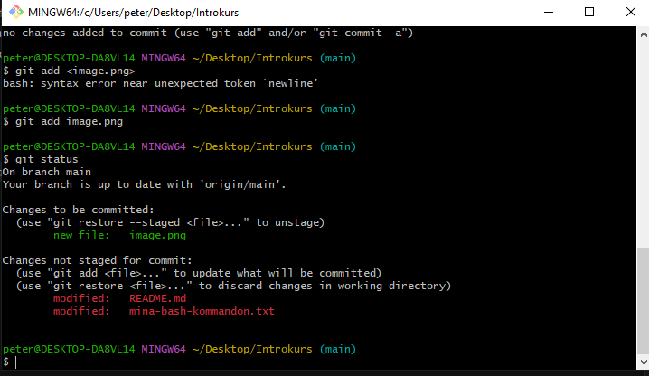
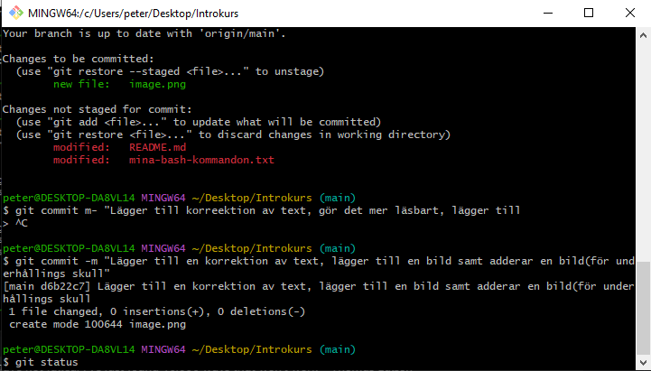

# Vertygsövning

# =titel ##=Subtitel ###=Sektioner
Detta projekt är en övning där jag använder terminaln, VS Code, 
Git & Github

## **Syfte**

Syftet är att träna på grundläggande arbetsflöden inom  mjukvaruutveckling

## __Git-begrepp__

- `git init` – skapar ett Git-repository i projektet.
- `git status` – visar vilka ändringar git känner till.
- `git add` – lägger till ändringar inför nästa commit.
- `git commit` – sparar en version i projektets versionshistorik.
- `git log` – visar tidigare commits.
- `git remote` – hanterar kopplingen till ett externt repository.
- `git push` – skickar mina commits till GitHub.
- `git pull` – hämtar ändringar från GitHub.
- `git remote add origin https://github.com/PeterBergeld/Verktygsovning.git` - Säger till datorn att detta är den designerade GitHub adressen

Markdown notis:
`` = Gör att det visas som kod, annars har markdown inget med själva 
    koden att göra, utan är en separat text. 
** = Bold
__ = Bold
< u >...</ u> = Understrucken OBS! ser det inte på github får använda mmig av --- under

### <u>Repository</u>
---

Ett repository är projektets gemensamma plats där kod, filer och
verionhistorik kan lagras.

### Commit 

En commit är en sparad version av förändringar i projektet.
"Vilket innehåll har sparats i denna commit"

### Versionhistorik

Versionhistoriken visar tidigare commits och gör det möjligt att se hur projektet har förändrats/utvecklats under tid.

## __Vad jag gjorde och varför__

Cd Desktop är mitt första kommando för att placera mig i rätt space.
mkdir Introkurs blir mitt nästa för att skappa mappen och går in genom cd Introkurs.
Jag skapar en map genom mkdir Vertygsovning, går in i den via cd Vertygsovning
Via kommandot pwd kollar jag att jag är rätt & ls kontrollerar jag innehållet.
Via terminalen skappar jag en fil med git touch "mina-bash-kommandon.txt"
kontroll via ls.
Går in mappen och i adressfältet skriver jag code . och kommer
på så sätt in i VS Studio Code och öppnar mappen! 
Jag adderar till .txt filen mina-bash-kommandon och sparar!

Skapar en README.md fil i VS CODE och skriver Vertygsövning och syfte med # samt ##. SPARAR!

Går in i GitHub och väljer namn Vertygsovning samt skapar repsoitory
git init för att skapa en repository i projekt mappen. 
Designerar till GitHub genom -git remote add origin https://github.com/PeterBergeld/Verktygsovning.git och shift+insert.
Kontroll genom git remote -v

git add mina-bash-kommandon.txt lägger till ändringen ner till stagingområdet inför nästa commit. 
Vid git status kommando får du meddelande "Changes not staged for commit" som säger mig att de inte blivit stagade än (git add < file >)
git commit -m "Lägger till dokumentation av bash-kommmandon"
vilket sparar commit. 

Jag adderar git add README.md för att sparas.

Sparar genom git commit -m "Lägger till README med beskriving av övning"
I VS CODE skriver jag in olika Git-kommandon i README.md för att sedan spara ner de genom git add README.md--->git commit -m "Lägger till förklaring av Git-kommandon"

Nästa steg blir att förklara olika Git-begrepp i README.md filen. 
Går vidare med git add README.md
git commit -m "Förklarar repository commit och versionhitorik"
git log för att kontrollera vad vi har som har adderats

mkdir DOCS 
cd DOCS
touch samarbete.md

In till VS CODE och samarbete.md och förklar vad ett Repository-samarbete innefattar

In i bash cd .. (Jag befinner mig nu i DOCS mappen)
git add DOCS/samarbete.md 
git commit -m "Lägger till dokumentation om repository samarbete"

git branch -M main (Huvudgrenen döps till main)

git push -u origin main

git push

Klar med övningen!

 ## **Reflektion**

 Går jag fram och tillaka med status, add . commit -m och push för att putsa, men framföärallt för att få det till ett återkommande mönster och hjärntvätts bettende. Min "logg" är väldigt svårläst som den ser ut i nuet. 

Ska tilläggas att i slutet såg jag att mina bash-kommandon inte hade pushats ut till GitHub och fick korrigera det efteråt med git add . och git push. GitHub underlättar extremt mycket och ger en möjligheten att jobba överallt i världen förutsatt att du har en uppkoppling. 
Som ett fint avslut adderar jag ett quote av Edision, tog lite tid, men var bara stimulerande 
* och _ = vid början och slutet av text skapar kursiv text. Kontroll med ctrl+k--->släpp + v 

 Börja inse att terminalen är ett starkt vertyg och det "smörjer" verkligen arbetsflödet. Måste bara bli bättre på det 

> _"I have not failed. I've just found_
> *10,000 ways that won't work"*
> *-Thomas Edison*